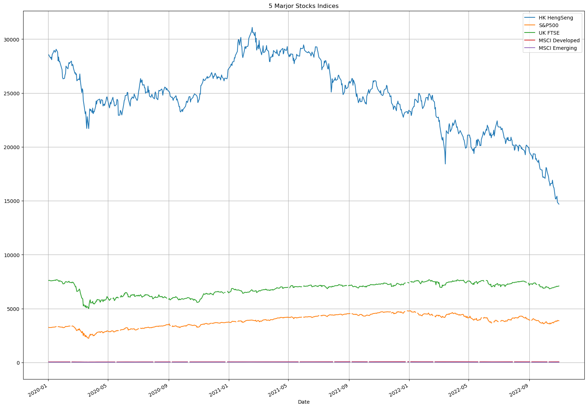
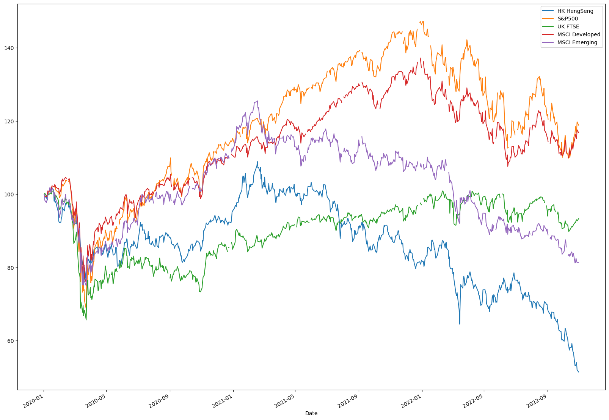
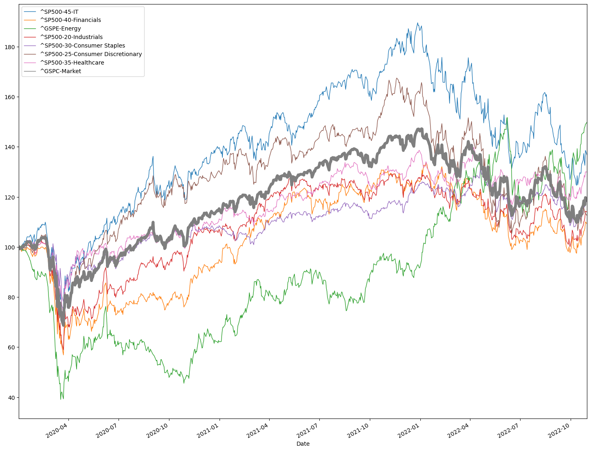
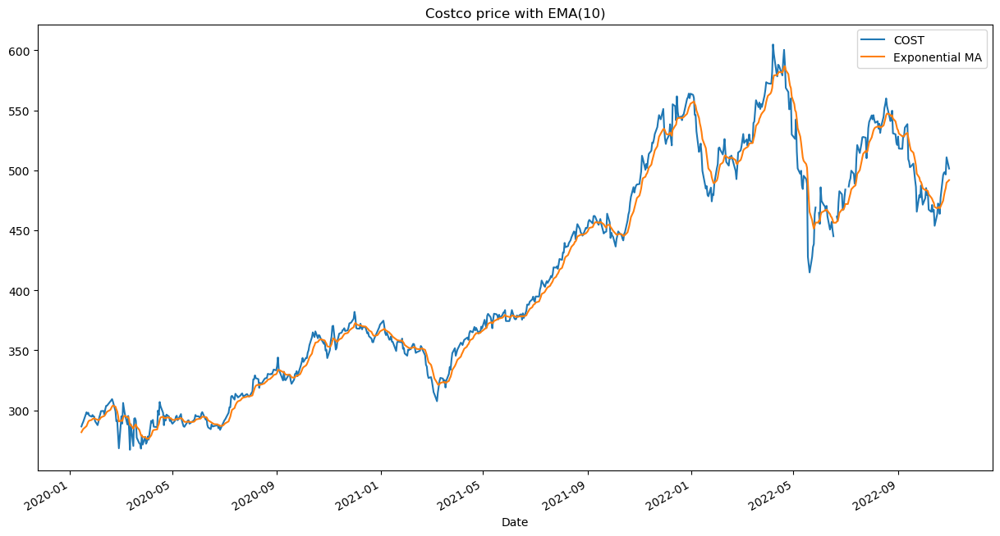

# finance_stats

**Keywords**: Statistical modeling, regression analysis, econometrics, financial statistics, trading

## Introduction
Quantitative analysis of impact on stock market in three different economies (US, Europe, China) with the following chosen market indices:

- **S&P500**: The Standard and Poor's 500, or simply the S&P 500, is a stock market index tracking the stock performance of 500 large companies listed on stock exchanges in the United States. 
- **FTSE 100**: The Financial Times Stock Exchange 100 Index, also called the FTSE 100 Index, is a share index of the 100 companies listed on the London Stock Exchange with (in principle) the highest market capitalisation. 
- **HSI**: The Hang Seng Index (HSI) is a freefloat-adjusted market-capitalization-weighted stock-market index in Hong Kong. It is used to record and monitor daily changes of the largest companies of the Hong Kong stock market and is the main indicator of the overall market performance in Hong Kong. 
- **MSCI Developed(^XWD.TO)**: a global investable market index that measures stock market performance from developed economies
- **MSCI Emerging(^XEM.TO)**: an index that captures large and mid-cap listed companies across 24 Emerging Market countries

Key financial numbers: ROE, P/E Ratio for fundemental analysis. 

## Analysis and Metrics:
- Conducted fundamental and regression analysis, including univariate and multivariate regression using exploratory variables such as Walmart's rate of return, S\&P 500 return, and the US Dollar Index, and a response variable of the company's rate of return.
- Performed ROI (rate on investment) analysis and correlation analysis to evaluate global stock market performance.
- Implemented an EMA10 (Exponential Moving Average 10 days) indicator for predictive modeling and forecasting.

## Packages and Technologies used:

- yfinance package: fetch JSON format data from Yahoo Finance API. [yFinance](https://pypi.org/project/yfinance/)
- MATLAB: Statistical Modeling and analysis
- Matplotlib: Data visualization
- Pandas: Data Manipulation and organisation [Pandas](https://pandas.pydata.org/)
- Scikit-Learn: Analysis [Scikit-Learn](https://scikit-learn.org/stable/)

## Usage:
- Install the dependencies:

| Dependency      | Installation commands |
| ----------- | ----------- |
| yfinance      | pip install yfinance       |
| pandas   | pip install pandas        |
| matplotlib   | pip install matplotlib        |

Both the files to be used has been provded as a Jupyter Notebook file, to use it:
- Run the cells in order 

(or)

`jupyter nbconvert --to python notebook.ipynb`
and run  `python3 notebook.py`

## Outputs:

## Contributing
1. Fork it (<https://github.com/yourname/yourproject/fork>)
2. Create your feature branch (`git checkout -b feature/fooBar`)
3. Commit your changes (`git commit -am 'Add some fooBar'`)
4. Push to the branch (`git push origin feature/fooBar`)
5. Create a new Pull Request

